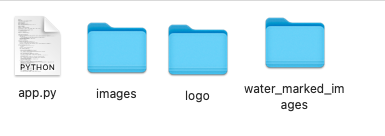

## Watermarker Program
This Python program creates watermarks with text and logos to protect your photos.

#### Requirements
- Python 3.x
- PIL (Python Imaging Library)
***
#### Step - 1: Prepare Your Images
Create a folder named `/images` in your project directory and place all the images you want to watermark into this folder. (Please DO NOT change the folder's name).

***
**Images inside the folder:**

***
#### Step - 2 (Optional): Add a Logo
If you want to add a logo to your images, create a folder named `/logo` and place your logo image in this folder. Valid extensions are: `.jpg`, `.jpeg`, `.png`, `.bmp`, `.gif`, `.tiff`.

***
**Logo image inside the folder:**

#### Running the Application
Execute `app.py` and you will be prompted to choose an option:

#### Processing
The application will process your images according to your choices:

***
#### Watermarked Images
A folder named `/water_marked_images` will be created to store the watermarked images:

**Sample watermarked images:**

With text only:

***

With logo only:

***
With both logo and text:

